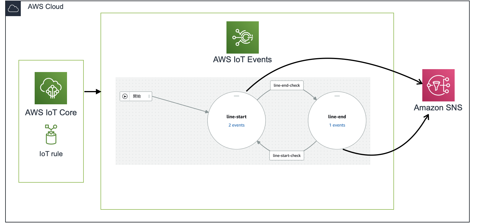

# AWS IoT Events sample with AWS CDK

AWS IoT Events sample project with AWS CDK.

As an example, Create a Detector Model for line start, and end.

## Sample Architecture Overview



## Getting Started

Please use the following command to get the code.

```
git clone https://github.com/tomoki10/aws-cdk-iot-event-sample.git
```

### Deploy

Add the relevant packages with yarn.

```
$ yarn
```

Use the following command or other methods to setting your AWS account credentials.

https://github.com/remind101/assume-role

Deploy to the AWS account.

```
$ yarn cdk deploy
```

### Test

#### IoT Events to SNS

You can send an payload to IoT Events and test its behavior with the following command.

```
aws iotevents-data batch-put-message --cli-input-json file://tests/sample-event/iot-events-test-payload.json
```

#### IoT Rule to IoT Events to SNS

Execute the following command to get `<IoT Core ATS Endpoint>`.

```
$ aws iot describe-endpoint --endpoint-type iot:Data-ATS
```

You can send an payload to IoT Rule and test its behavior with the following command.

```
$ aws iot-data publish --cli-input-json file://tests/sample-event/iot-rule-test-payload.json --endpoint-url "<Your IoT Core ATS Endpoint>"
```
